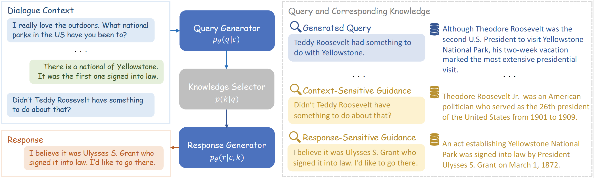

<h2 align="center">Query Enhanced Knowledge-Intensive Conversation via Unsupervised Joint Modeling</h2>
<p align="center">
  <!-- <a href="https://2022.emnlp.org/"></a> -->
  <a href="http://arxiv.org/abs/2212.09588"></a> 


## Overview
**QKConv** is an unsupervised query enhanced model for knowledge-intensive conversations via joint training, which consists of a query generator, an off-the-shelf knowledge selector, and a response generator.


<p align="center">
  
</p>

* QKConv does not require extra supervision, such as query annotations and knowledge retrieval provenance, and solely utilizes the dialogue context and target response.
* The joint training of QKConv boosts query generation toward better knowledge selection and fosters knowledge utilization in response generation.
* We evaluate our approach on conversational question answering, task-oriented dialogue, and open-domain knowledge-grounded dialogue. QKConv achieves the state-of-the-art unsupervised performance on three datasets and even outperforms certain supervised methods.


## Requirements and Installation
- python version >= 3.8
- If you want to test QReCC dataset, you need to install Java 11 for BM25 retrieval.

```bash
pip install -r requirements.txt
```

## Usage
### Preparation
Prepare datasets, knowledge selectors and generation models.

| task | dataset | index | models |
| ------------- | ------------- | ------------- | ------------- |
| Task-oriented Dialogue | [SMD](https://nlp.stanford.edu/blog/a-new-multi-turn-multi-domain-task-oriented-dialogue-dataset/) | \ | [smd-t5-large](https://dialogue.bj.bcebos.com/Knover/projects/QKConv/QKConv_t5-large_SMD.tar) |
| Conversational Question Answering | [QReCC](https://zenodo.org/record/5115890) | [BM25 index builder](https://github.com/apple/ml-qrecc/tree/main/collection) | [qrecc-t5-base](https://dialogue.bj.bcebos.com/Knover/projects/QKConv/QKConv_t5-base_QReCC.tar) |
| Open-domain Knowledge-grounded Dialogue | [KILT WoW](https://github.com/facebookresearch/KILT) | [passages file](http://dl.fbaipublicfiles.com/KILT/kilt_knowledgesource.json)<br>[index file](http://dl.fbaipublicfiles.com/KILT/kilt_db_simple.npz) | [wow-bart-large](https://dialogue.bj.bcebos.com/Knover/projects/QKConv/QKConv_bart-large_WoW.tar) |

All data can be downloaded by [prepare.sh](prepare.sh) except for QReCC's BM25 index.
```bash
bash ./prepare.sh
```

### Inference and Evaluation
Use fine-tuned model with default hyperparameters to infer datasets.
```bash
python3 infer.py \
    --dataset <type of dataset, smd/qrecc/wow> \
    --infer_file <path of dataset> \
    --model_path <path of model> \
    --batch_size 4 \
    --save_file <path of inference results>
```

Evalute performances of knowledge selection and response generation.
```bash
python3 evaluate.py \
    --dataset <type of dataset, smd/qrecc/wow> \
    --pred_file <path of inference results> \
    --save_file <path of evluation results> \
    --entity_file <path of SMD enentity file, unnecessary for qrecc and wow>
```